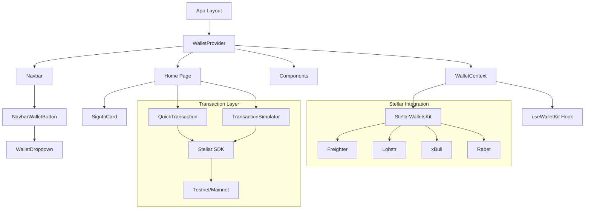
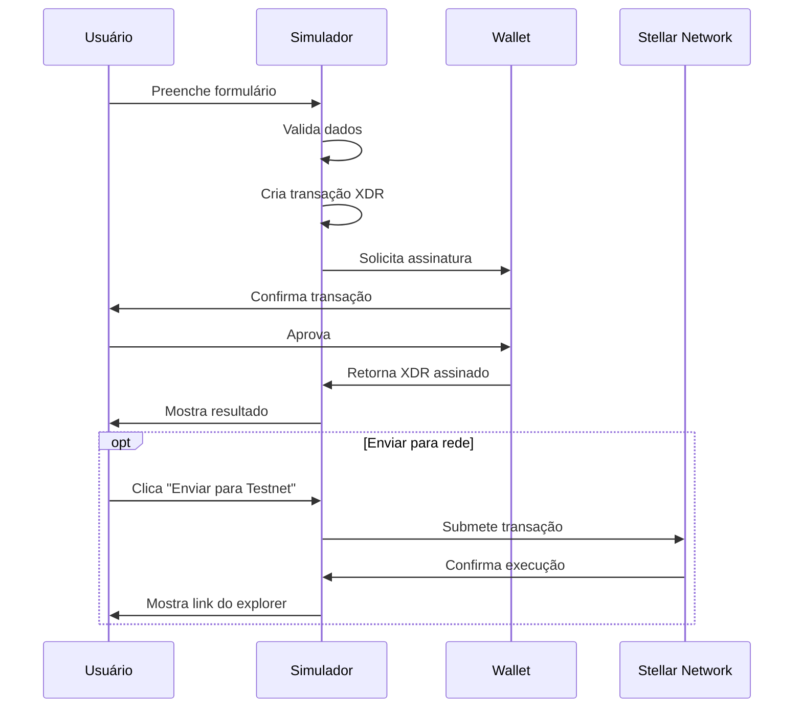

# 🚀 Apollo Stellar Wallet Kit - Frontend

<div align="center">
  
  
  
  
</div>

<div align="center">
  <h3>🌟 Interface moderna para integração com wallets Stellar</h3>
  <p>Conecte, gerencie e simule transações na rede Stellar com facilidade</p>
</div>

---

## 📖 Índice

- [✨ Features](#-features)
- [🏗️ Arquitetura](#️-arquitetura)
- [🚀 Instalação](#-instalação)
- [💻 Uso](#-uso)
- [🔧 Configuração](#-configuração)
- [📱 Componentes](#-componentes)
- [🧪 Simulador de Transações](#-simulador-de-transações)
- [🌐 Wallets Suportadas](#-wallets-suportadas)
- [📚 API Reference](#-api-reference)
- [🔍 Debugging](#-debugging)
- [🤝 Contribuição](#-contribuição)

---

## ✨ Features

### 🔗 **Conectividade de Wallet**
- ✅ Integração com **StellarWalletsKit**
- ✅ Suporte a múltiplas wallets (Freighter, Lobstr, xBull, Rabet)
- ✅ Conexão/desconexão seamless
- ✅ Persistência de sessão
- ✅ Detecção automática de wallets instaladas

### 🎨 **Interface Moderna**
- ✅ Design responsivo e elegante
- ✅ Tema dark/light customizável
- ✅ Navegação intuitiva
- ✅ Componentes reutilizáveis
- ✅ Feedback visual em tempo real

### 🧪 **Simulador de Transações**
- ✅ Teste rápido de assinatura
- ✅ Simulador completo com tipos de transação
- ✅ Suporte a Testnet para testes seguros
- ✅ Visualização de XDR e resultados
- ✅ Envio opcional para rede

### 🛡️ **Segurança & Qualidade**
- ✅ TypeScript para type safety
- ✅ Error handling robusto
- ✅ Logs detalhados para debugging
- ✅ Validação de inputs
- ✅ Prevenção de hydration errors

---

## 🏗️ Arquitetura



### 📁 **Estrutura de Pastas**

```
apollo/
├── src/
│   ├── app/                    # Next.js App Router
│   │   ├── globals.css         # Estilos globais
│   │   ├── layout.tsx          # Layout principal
│   │   └── page.tsx            # Página inicial
│   ├── components/             # Componentes reutilizáveis
│   │   ├── Footer/             # Componentes do rodapé
│   │   ├── Home/               # Componentes da home
│   │   ├── Navbar/             # Componentes da navbar
│   │   ├── Transaction/        # Simuladores de transação
│   │   ├── Ui/                 # Componentes base (Button, etc)
│   │   ├── Wallet/             # Componentes de wallet
│   │   └── ClientOnly.tsx      # Wrapper SSR-safe
│   ├── contexts/               # React Contexts
│   │   └── WalletContext.tsx   # Contexto global da wallet
│   ├── hooks/                  # Custom Hooks
│   │   └── useWalletKit.ts     # Hook principal da wallet
│   ├── sections/               # Seções de página
│   │   ├── Footer.tsx
│   │   ├── Home.tsx
│   │   └── Navbar.tsx
│   ├── utils/                  # Utilitários
│   │   └── walletErrorHandler.ts # Tratamento de erros
│   └── assets/                 # Recursos estáticos
├── public/                     # Arquivos públicos
├── package.json               # Dependências
└── README.md                  # Esta documentação
```

---

## 🚀 Instalação

### 📋 **Pré-requisitos**
- Node.js 18+ 
- Yarn ou npm
- Uma wallet Stellar instalada (recomendado: Freighter)

### ⚡ **Setup Rápido**

```bash
# 1. Clone o repositório
git clone [repo-url]
cd apollo-front/apollo

# 2. Instale as dependências
yarn install
# ou
npm install

# 3. Execute o projeto
yarn dev
# ou
npm run dev

# 4. Acesse no navegador
open http://localhost:3000
```

### 📦 **Dependências Principais**

```json
{
  "dependencies": {
    "@creit.tech/stellar-wallets-kit": "^1.9.5",
    "@stellar/stellar-sdk": "^14.1.1",
    "next": "15.5.3",
    "react": "19.0.0",
    "tailwindcss": "^3.4.1"
  }
}
```

---

## 💻 Uso

### 🔗 **1. Conectar Wallet**

```typescript
import { useWalletKit } from '@/hooks/useWalletKit';

function MyComponent() {
  const { walletInfo, connect, disconnect } = useWalletKit();

  const handleConnect = async () => {
    try {
      await connect();
      console.log('Wallet conectada:', walletInfo.address);
    } catch (error) {
      console.error('Erro ao conectar:', error);
    }
  };

  return (
    <div>
      {walletInfo.isConnected ? (
        <div>
          <p>Conectado: {walletInfo.formattedAddress}</p>
          <button onClick={disconnect}>Desconectar</button>
        </div>
      ) : (
        <button onClick={handleConnect}>Conectar Wallet</button>
      )}
    </div>
  );
}
```

### 🧪 **2. Simular Transações**

```typescript
import { useWalletKit } from '@/hooks/useWalletKit';
import * as StellarSdk from '@stellar/stellar-sdk';

function TransactionExample() {
  const { signTransaction, walletInfo } = useWalletKit();

  const createPayment = async () => {
    // Criar transação
    const server = new StellarSdk.Horizon.Server('https://horizon-testnet.stellar.org');
    const sourceAccount = await server.loadAccount(walletInfo.address);
    
    const transaction = new StellarSdk.TransactionBuilder(sourceAccount, {
      fee: StellarSdk.BASE_FEE,
      networkPassphrase: StellarSdk.Networks.TESTNET,
    })
    .addOperation(
      StellarSdk.Operation.payment({
        destination: 'GDESTINATION...',
        asset: StellarSdk.Asset.native(),
        amount: '1',
      })
    )
    .setTimeout(300)
    .build();

    // Assinar transação
    const signedXDR = await signTransaction(transaction.toXDR());
    console.log('Transação assinada:', signedXDR);
  };

  return (
    <button onClick={createPayment}>
      Criar Pagamento
    </button>
  );
}
```

---

## 🔧 Configuração

### 🌐 **Redes Suportadas**

```typescript
// Testnet (padrão para desenvolvimento)
const TESTNET_CONFIG = {
  networkPassphrase: StellarSdk.Networks.TESTNET,
  horizonUrl: 'https://horizon-testnet.stellar.org',
  friendbotUrl: 'https://friendbot.stellar.org'
};

// Mainnet (produção)
const MAINNET_CONFIG = {
  networkPassphrase: StellarSdk.Networks.PUBLIC,
  horizonUrl: 'https://horizon.stellar.org'
};
```

### 🎨 **Personalização do Tema**

```css
/* globals.css */
:root {
  --color-bg-page: #0B0D17;
  --color-bg-cards: #151722;
  --color-text-primary: #FFFFFF;
  --color-text-secondary: #9CA3AF;
  --color-button-primary: #3B82F6;
  --color-border: #2D3748;
}
```

### ⚙️ **Configuração das Wallets**

```typescript
// WalletContext.tsx
const allowedModules = [
  FreighterModule,
  xBullModule, 
  RabetModule,
  LobstrModule
  // AlbedoModule removido por simplicidade
];

const stellarKit = new StellarWalletsKit({
  network: WalletNetwork.PUBLIC, // ou TESTNET
  selectedWalletId: FREIGHTER_ID,
  modules: allowedModules,
});
```

---

## 📱 Componentes

### 🧩 **Componentes Base**

#### **BaseButton**
```typescript
interface BaseButtonProps {
  variant: 'primary' | 'secondary' | 'outline' | 'transparent';
  children: React.ReactNode;
  onClick?: () => void;
  disabled?: boolean;
  className?: string;
}
```

#### **ClientOnly**
```typescript
// Previne erros de hidratação SSR
<ClientOnly fallback={<LoadingComponent />}>
  <WalletComponent />
</ClientOnly>
```

### 🔗 **Componentes de Wallet**

#### **NavbarWalletButton**
- Conectar/desconectar wallet
- Dropdown com informações
- Responsivo (desktop/mobile)

#### **WalletDropdown**
- Informações da wallet conectada
- Opção de desconectar
- Design elegante com animações

#### **SignInCard**
- Call-to-action para conexão
- Estado dinâmico baseado na conexão
- Layout responsivo

---

## 🧪 Simulador de Transações

### ⚡ **Teste Rápido**
- Verificação básica de assinatura
- XDR de exemplo pré-definido
- Feedback imediato

### 🔬 **Simulador Completo**

#### **Tipos de Transação Suportados:**

1. **💸 Payment (Pagamento)**
   ```typescript
   StellarSdk.Operation.payment({
     destination: 'GDESTINATION...',
     asset: StellarSdk.Asset.native(),
     amount: '10'
   })
   ```

2. **👤 Create Account (Criar Conta)**
   ```typescript
   StellarSdk.Operation.createAccount({
     destination: 'GNEWACCOUNT...',
     startingBalance: '10'
   })
   ```

#### **Fluxo de Teste:**



---

## 🌐 Wallets Suportadas

### ✅ **Wallets Integradas**

| Wallet | Status | Detecção | Mobile | Desktop |
|--------|--------|----------|---------|---------|
| **Freighter** | ✅ Ativo | `window.freighter` | ❌ | ✅ |
| **Lobstr** | ✅ Ativo | `window.lobstrWallet` | ✅ | ✅ |
| **xBull** | ✅ Ativo | `window.xBull` | ✅ | ✅ |
| **Rabet** | ✅ Ativo | `window.rabet` | ❌ | ✅ |
| **Albedo** | ❌ Removido | - | ✅ | ✅ |

### 🔍 **Debug de Detecção**

```javascript
// Console do navegador - verificar wallets
console.log('Freighter:', typeof window.freighter !== 'undefined');
console.log('Lobstr:', typeof window.lobstrWallet !== 'undefined');
console.log('xBull:', typeof window.xBull !== 'undefined');
console.log('Rabet:', typeof window.rabet !== 'undefined');

// Ou usar o helper global
window.apolloWallet?.getWalletInfo();
```

---

## 📚 API Reference

### 🎣 **useWalletKit Hook**

```typescript
interface WalletKit {
  // Estado
  walletInfo: {
    address: string | null;
    formattedAddress: string;
    walletName: string | null;
    walletType: string;
    isConnected: boolean;
    isLoading: boolean;
    error: string | null;
  };
  
  connectionStatus: 'connecting' | 'connected' | 'error' | 'disconnected';
  isWalletAvailable: boolean;
  
  // Ações
  connect: () => Promise<void>;
  disconnect: () => void;
  signTransaction: (xdr: string) => Promise<string>;
  
  // Utilitários
  formatAddress: (address: string, length?: number) => string;
  getWalletInfo: () => object;
  kit: StellarWalletsKit | null;
}
```

### 🔧 **WalletContext**

```typescript
interface WalletContextType {
  wallet: WalletState;
  kit: StellarWalletsKit | null;
  connectWallet: () => Promise<void>;
  disconnectWallet: () => void;
  signTransaction: (transactionXDR: string) => Promise<string>;
  getWalletInfo: () => object;
}
```

### 🎯 **Eventos e Callbacks**

```typescript
// Conexão bem-sucedida
const handleConnection = (walletData) => {
  console.log('Wallet conectada:', {
    address: walletData.address,
    type: walletData.selectedWallet.name,
    network: 'Stellar'
  });
};

// Erro de conexão
const handleError = (error) => {
  if (isUserCancellation(error)) {
    console.log('Usuário cancelou conexão');
  } else {
    console.error('Erro real:', error);
  }
};
```

---

## 🔍 Debugging

### 🐛 **Logs Detalhados**

O projeto inclui logs extensivos para debugging:

```typescript
// Logs automáticos no console
🔍 APOLLO WALLET DEBUG - Verificando wallets no navegador
📍 Resultado do getAddress(): { address: "GABC..." }
🔑 Chave pública: "GABC..."
🌐 Detalhes da rede: { network: "PUBLIC", ... }
💾 Dados salvos no localStorage
🎯 Estado final da wallet: { isConnected: true, ... }
```

### 🔧 **Ferramentas de Debug**

```javascript
// Global debugging helper
window.apolloWallet = {
  getWalletInfo: () => { /* dados da wallet */ },
  kit: stellarKitInstance,
  state: walletState
};

// Verificar estado atual
console.log(window.apolloWallet.getWalletInfo());
```

### 🚨 **Problemas Comuns**

#### **Wallet não detectada**
```bash
✅ Soluções:
1. Verificar se a extensão está instalada
2. Recarregar a página
3. Verificar console para logs de detecção
4. Aguardar 1-2 segundos após carregar a página
```

#### **Erro de hidratação**
```bash
✅ Soluções:
1. Componentes de wallet já estão wrapped com ClientOnly
2. StellarWalletsKit inicializa apenas no cliente
3. localStorage acessado apenas no cliente
```

#### **Transação falhando**
```bash
✅ Verificar:
1. Wallet está na rede correta (Testnet/Mainnet)
2. Conta tem saldo suficiente
3. Endereço de destino é válido
4. XDR está bem formado
```

---

## 🧪 Testes

### 🔬 **Testnet Setup**

```bash
# 1. Configurar wallet para Testnet
# Freighter: Settings → Network → Testnet

# 2. Obter XLM de teste
curl "https://friendbot.stellar.org/?addr=SEU_ENDERECO_AQUI"

# 3. Verificar saldo
# Horizon Testnet: https://horizon-testnet.stellar.org/accounts/SEU_ENDERECO
```

### ✅ **Checklist de Testes**

- [ ] Conectar wallet
- [ ] Desconectar wallet  
- [ ] Persistência da sessão
- [ ] Teste rápido de assinatura
- [ ] Simulação de pagamento
- [ ] Simulação de criação de conta
- [ ] Envio para Testnet
- [ ] Responsividade mobile
- [ ] Error handling

---

## 🚀 Deploy

### 📦 **Build de Produção**

```bash
# Build do projeto
yarn build

# Verificar build
yarn start

# Deploy (exemplo com Vercel)
npx vercel --prod
```

### ⚙️ **Variáveis de Ambiente**

```bash
# .env.local
NEXT_PUBLIC_STELLAR_NETWORK=PUBLIC  # ou TESTNET
NEXT_PUBLIC_HORIZON_URL=https://horizon.stellar.org
```

---

## 🤝 Contribuição

### 🔧 **Desenvolvimento**

```bash
# Setup do ambiente de desenvolvimento
git clone [repo]
cd apollo-front/apollo
yarn install
yarn dev

# Executar testes
yarn test

# Verificar linting
yarn lint

# Build de produção
yarn build
```

### 📝 **Padrões de Código**

- **TypeScript** para type safety
- **ESLint + Prettier** para formatação
- **Conventional Commits** para mensagens
- **Component-first** architecture
- **Custom hooks** para lógica reutilizável

### 🐛 **Reportar Issues**

Ao reportar problemas, inclua:
- Versão do navegador
- Wallet utilizada
- Console logs
- Passos para reproduzir

---

## 📄 Licença

Este projeto está sob a licença MIT. Veja o arquivo `LICENSE` para detalhes.

---

## 🙏 Agradecimentos

- **Stellar Development Foundation** - Pela rede Stellar
- **Creit.tech** - Pelo StellarWalletsKit
- **Freighter, Lobstr, xBull, Rabet** - Pelas wallets integradas
- **Next.js Team** - Pelo framework
- **Vercel** - Pela plataforma de deploy

---

<div align="center">
  <h3>🌟 Feito com ❤️ para a comunidade Stellar</h3>
  <p>
    <a href="#-apollo-stellar-wallet-kit---frontend">Voltar ao topo ↑</a>
  </p>
</div>